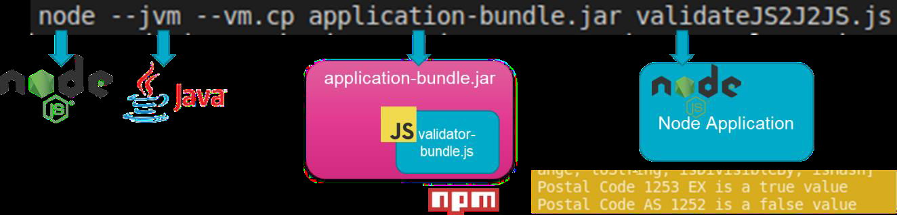

# Node Calling Java

`cd /labs/js2java`{{execute}}

Open file Joker.js. It is monoglot – and utterly dull. The Joker does not have a single Joke. Very unfortunate.

`cat joker.js`{{execute}}

Run the application:
`node joker.js`{{execute}} 

You will not be dazzled, no tricks up anyone’s sleeves.
Now open the file joker2.js. Things start to look more interesting. The joker still does not have any jokes – but he has a friend. A Java Class, called Joker, that may help out.

Run the application with this command

`node --jvm --vm.cp application-bundle.jar joker2.js`{{execute}}

Now there should be jokes cracked left and right. They must be produced by the Java Joker. Take a look at the file Joker.java in folder nl/amis/js2java to see how that class is coded. And to see that is not aware of the fact that it is used in a polyglot context. This is just a regular Java Class, doing its thing.

File joker3.js takes another step. It shows how we can post parameters and exchange more complex objects – such as an Array and a Map – between JavaScript and Java..

Run the application with this command

`node --jvm --vm.cp application-bundle.jar joker3.js`{{execute}}

## VALIDATOR APPLICATION
Open file validateJS2J2JS.js. The JavaScript application wants to validate a Postal Code. The developer knew about the Java Class ValidateThroughNPMValidator that we created a little earlier on, so she though she might as well make use of it.

Run the application with this command
`node --jvm --vm.cp application-bundle.jar validateJS2J2JS.js`{{execute}}
and find that two postal codes are validated.

The remarkable thing here is that what is actually taking place is JavaScript executing Java code that in turn is executing JavaScript code. Not an obvious thing to do – but not a problem on a technical level.

