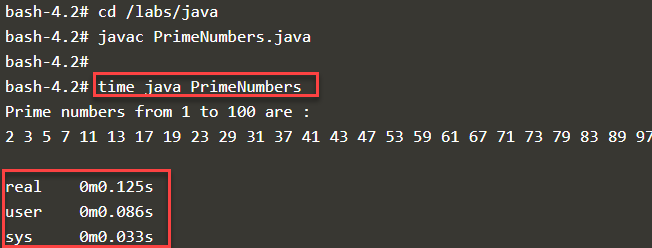

# Ahead of Time Polyglot Application Compilation with GraalVM

This step will focus on a specific GraalVM capability, i.e. GraalVM Ahead-of-time Compilation (AOT) and more specifically on GraalVM native-image feature with Java functions.

## Ahead of Time Compilation - generating native image 

The GraalVM native image utility has been installed in the Virtual Machine. However, the AOT compilation requires a fair amount of memory. It may exhaust the physical resources in the Katacoda environment. Let's try producing a native image for the PrimeNumbers Java application that you ran in the previous step. It will take up to one minute - and it will report on its progress.

```
cd /labs/java
$GRAALVM_HOME/bin/native-image --verbose -H:Name=primes -H:Class=PrimeNumbers
```{{execute}}

If this works as intended, you will get some output from the native-image generator and the phases it progresses through in order to produce the executable. When it is done, you can check on he result:

`ls -l`{{execute}}

There should be an executable file called *primes* of less than 4 MB in file size. That is the entire executable. No Java runtime is required to run it. That 4 MB includes everything. 

Run it:

`./primes`{{execute}}

Get the timing for the AOT versions of PrimeNumbers:

```
time ./primes
time java PrimeNumbers
```{{execute}}

Compare with the timing for the cold start JIT version that you took in the previous step.


Both are pretty fast presumably, but the native executable should still be much faster than the JIT compiled one. The difference in resource usage - both CPU and especially memory - will be very substantial as well. And of course, to run the native image you do not need a Java runtime environment. No hassle of installing and upgrading, no diskspace allocated. Think what that means for container images: instead of the Java Runtime, all they need to contain is... the tiny executable. This is why frameworks such as Quarkus, Micronaut, Helidon and in the near future Spring as well all support running as native executable produced by GraalVM.


## Advanced AOT - Getting Ahead of Ourselves
A first quick attempt you could make to create a natively executable image of the HelloWorld class *with embedded JavaScript* (Java interoperating with JavaScript, turned into a native executable):

```
cd /labs/js2java
$GRAALVM_HOME/bin/native-image -cp ./application-bundle.jar --language:js --verbose -H:Name=hello -H:Class=nl.amis.java2js.HelloWorld
```{{execute}}

Even this extremely simple example takes more than five minutes to create the executable file. The closed world analysis of all dependencies and the production of the executable need time and memory.

The result should be a natively executable file of moderate size (compared to the Java Runtime environment you would need to run the HelloWorld class with JIT compilation)

Run this executable with the following command. No Java, no classpath. Only this one file (that contains a JavaScript runtime engine as well as the as yet unparsed, unprocessed JavaScript snippets):

`./hello`{{execute}}


This tells you that the run time image - a combination of Java & JavaScript runtime engines along with the application - is close to 100MB. Without the JavaScript runtime, it would have been closer to 20MB. The startup time is phenomenal: less than 10 ms.