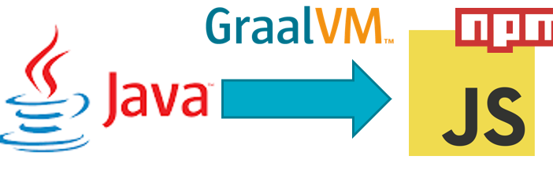
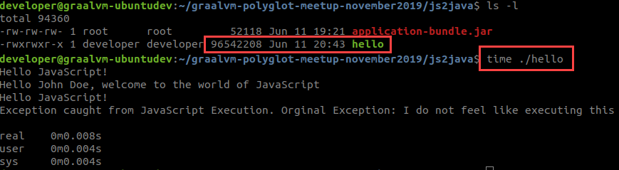

# Polyglot Interoperability: Java Calling JavaScript

GraalVM is not only a superior JIT compiler as well as an AOT compiler that produces natively executable images from Java applications. It is also a polyglot runtime platform for many programming languages and it offers polyglot interoperability. A program written in one language can execute snippets (or chunks) written in a different language, thus leveraging existing libraries and components and leveraging the strengths of each language. To add a certain *je ne sais quoi* to a program. And capture the *zeitgeist* with the hottest programming language in town.

In this section, you will see the first examples of Polyglot Interoperability - starting from Java and calling out to JavaScript.

## Execute Polyglot Java Class HelloWorld
Here the HelloWorld example – the gentle introduction into Java code interacting with JavaScript. Your first taste of polyglot interoperability.

From folder /labs/java2js, 

`cd /labs/java2js`{{execute}}

Generate a .class with the javac command and then check the code outputs as expected:
```
javac nl/amis/java2js/HelloWorld.java

java nl/amis/java2js/HelloWorld
```{{execute}}

It may feel as if you have executed just some Java code. However, the Java Class engaged JavaScript to do some of the work. Nothing spectacular as such – but two languages as brothers in arms at run time. That in itself is quite something!

## Inspecting the Interoperability in the Source Code

Inspect the contents of the Java Class definition:

`cat nl/amis/java2js/HelloWorld.java`{{execute}}

The polyglot context object is the bridge between Java and JavaScript. Not only can we execute JavaScript snippets and get simple values returned, the JavaScript code can also return a function – that we can execute later on – and many times – from Java.

The line
`polyglot.eval("js", "console.log('Hello JavaScript!')");`
simply executes a JS snippet that prints a string to the system output. Seems innocent enough. But of course it is quite significant. It is a Mama Mia! in a piece of English text. A JavaScript statement in the middle of a Java program. With hardly any ceremony.

And it gets better:
```
Value helloWorldFunction= polyglot.eval("js"
        		               , "(function(name) { return `Hello ${name}, welcome to the world of JavaScript` })");
// Use the function
String greeting = helloWorldFunction.execute("John Doe").asString();
System.out.println(greeting);
```
The `polyglot.eval` call evaluates the JavaScript snippet (again). This snippet evaluates to a function object. This object is not executed - it is returned. In Java, we now have at our disposal a function object (reference) in variable *helloWorldFunction*. We can invoke this function as many times as we like. simply by executing the *execute* method on the object, passing in the input parameters required by the function that we want to have executed. The call *helloWorldFunction.execute("John Doe")* execute the function that was defined in JavaScript. We, Java developers who simply have been given the function reference, are not bothered at all by the fact that JavaScript is lurking under the covers. It is transparent to us. 

The result of executing the function is simply returned as excepted from any Java method call.

### Catching Exceptions from The Other Side
The Java code that invokes the JavaScript can of course run into exceptions in the foreign language. With a fairly straightforward `try { } catch() {}` the code can catch these runtim PolyglotExceptions and inspect them and act upon them:

```
try {
	polyglot.eval("js", "console.log('Hello JavaScript!'); throw 'I do not feel like executing this';");
} catch (PolyglotException e) {
    System.out.println("Exception caught from JavaScript Execution. Orginal Exception: "+e.getMessage());
 } 
```        

## Load and Execute JavaScript from Resource File

JavaScript code does not need to be inline or embedded as Strings in the Java source. In fact, it is probably a much better idea to keep Java and JavaScript in separate files as much as possible.

Check class LoadAndRunJS. In this class you will find a simple example of how the JavaScript is not embedded in Java, but is loaded from a separate file – calculator.js - instead.

`cat nl/amis/java2js/LoadAndRunJS.java`{{execute}}

Using the ClassLoader to load a file resource, the JavaScript functions *Calculator* and *Fibonacci* are loaded. Subsequently, the loaded snippets of JS code are evaluated through the Polyglot context object, resulting in a bindings object (a Map) that has the functions as entries. The names of the JS functions are the keys of the objects in *binding*.  

```
cd /labs/java2js

javac nl/amis/java2js/LoadAndRunJS.java

java nl/amis/java2js/LoadAndRunJS
```{{execute}}
So this Java Class is producing Fibonacci and SQRT results - without doing any calculations itself. It leverages a library - written in JavaScript.

### Extending the Calculator's capabilities

Add a function to the file /labs/java2js/calculator.js:
```
echo -e "\n function doubleIt(num) { \n return 2*num \n}" >> /labs/java2js/calculator.js
cat  /labs/java2js/calculator.js
```{{execute}}
Check that the function doubleIt is now part of the library calculator.js.

Now execute the LoadAndRunJS class again - without having made any change or recompiled the class:

```
java nl/amis/java2js/LoadAndRunJS
```{{execute}}
The Java Class evaluates the JavaScript library calculator.js each time it is run. It now finds function *doubleIt* and executes it.

## Callback from JavaScript to Java
Check class CallbackFromJS2J. In this class, a call is made to JavaScript – after a Java object has been instantiated and put in the bindings map in the Polyglot context. The JavaScript code can retrieve this object and invoke methods on it.

`cat /labs/java2js/nl/amis/java2js/CallbackFromJS2J.java`{{execute}}

The *doIt* method instantiates an Object based on JavaClass *FriendlyNeighbour* and stores this class in the bindings object. This makes it available to the JavaScript code invoked by CallbackFromJS2J.

The definition of Class *FriendlyNeighbour* is shown here:
`cat  /labs/java2js/nl/amis/java2js/FriendlyNeighbour.java`{{execute}}

So we have:
*CallbackFromJS2J (Java) => JavaScript snippet => FriendlyNeighbour (Java)* 

To execute:
```
cd /labs/java2js

javac nl/amis/java2js/FriendlyNeighbour.java
javac nl/amis/java2js/CallbackFromJS2J.java

java nl/amis/java2js/CallbackFromJS2J
```{{execute}}
Here you see the result of Java executing JavaScript that leverages a Java object instantiated by the calling Java code. Note: the JS snippet does not know that object *friend* is a Java object. To the JS snippet, this is a generic, polyglot object that can have properties such as readable and settables variables and calleable functions. 

You could try additional things, such as adding variables or methods to the FriendlyNeighbour class and see if you can execute and access methods and data from both sides of the polyglot divide.

## Leverage NPM Module from Java - for Validating Postal Codes

Our challenge: implement validations of postal codes, across multiple countries, in our Java application. Our frustration: having to write such code while we know it already exists in the form of an NPM module called Validator – freely available in the open source domain. However: it is in JavaScript.

GraalVM to the rescue: we can now from the comfort of our Java application enlist the help of modules written in JavaScript. This challenge is discussed in detail in [this article](https://technology.amis.nl/2019/10/25/leverage-npm-javascript-module-from-java-application-using-graalvm/).



The most important thing we need to find a workaround for is: how to make GraalJS – the JavaScript implementation on GraalVM – work with the module structure in the NPM Validator module. GraalJS does not support *require()* or *CommonJS*. In order to make it work with NPM modules – they have to be turned into ‘flat’ JavaScript resources – self-contained JavaScript source file. This can be done using one of the many popular open-source bundling tools such as Parcel, Browserify and Webpack. 

Note: ECMAScript modules can be loaded in a Context simply by evaluating the module sources. Currently, GraalVM JavaScript loads ECMAScript modules based on their file extension. Therefore, any ECMAScript module must have file name extension .mjs.

The steps to turn an NPM module into a self contained bundle dat GraalVM can process are these:
• check GraalVM compatibility of NPM module at https://www.graalvm.org/docs/reference-manual/compatibility/#validator
• install webpack and webpack-cli
• install npx (executable runner – complement to npm which is not included with GraalVM platform)
• install validator module with npm
• produce self contained bundle for validator module with webpack
In the interest of time and because the resulting validatorbundled.js file is already included in the workshop resources –there is no absolute need for you to perform these installations at this moment. So let’s skip them (if you are interested in the details, please refer to the blog article.

The outcome is a file called validatorbundled.js that contains the sublimation of all modules that contribute to the Validator module. 
You can take a look at this file:
`cat /labs/java2js/validatorbundled.js`{{execute}}

We can now use this file as JavaScript resource in our Java application. Check Java class ValidateThroughNPMValidator:
`cat /labs/java2js/nl/amis/java2js/ValidateThroughNPMValidator.java`

See how this class loads the validatorbundled.js using the ClassLoader (for example from the JAR file) – or from an absolute path on the file system (used when we create a native image of this Java application, see below). The source loaded from file is evaluated against the Polyglot JavaScript context. As a result, all top level functions in the Validator module are now executable from within the Java application. 

Note: the JS source is loaded in a static initializer. That means that we can turn this Java Class into a native image with the JS included in the image. We can do this because we can instruct the native image generator to generate the image after first executing the static initializers.

To execute the Java application that leverages validations provided through the NPM *validator* module, execute this next command:
```
cd /labs/java2js

javac nl/amis/java2js/ValidateThroughNPMValidator.java

java nl/amis/java2js/ValidateThroughNPMValidator
```{{execute}}
In the output, you will find a list of all validation functions now at our disposal in Java code, without programming a single letter of it.

The validation results printed to the output are produced from these lines of Java code:
```
public Boolean isPostalCode(String postalCodeToValidate, String country) {
		Value postalCodeValidator = c.getBindings("js").getMember("isPostalCode");
		Boolean postalCodeValidationResult = postalCodeValidator.execute(postalCodeToValidate, country).asBoolean();
		return postalCodeValidationResult;
	}

	public static void main(String[] args) {
		ValidateThroughNPMValidator v = new ValidateThroughNPMValidator();
		System.out.println("Postal Code Validation Result " + v.isPostalCode("3214 TT", "NL"));
		System.out.println("Postal Code Validation Result " + v.isPostalCode("XX 27165", "NL"));
	}
```


# Bonus: Advanced AOT - Native Image for Polyglot Java Applications

The following statement is used to create a natively executable image of the HelloWorld class *with embedded JavaScript* (Java interoperating with JavaScript, turned into a native executable). 

However, the Katacoda environment does not offer the required runtime resourcs to carry out this operation. The closed world analysis of all dependencies and the production of the executable need time and more memory than available.

```
cd /labs/java2js
$GRAALVM_HOME/bin/native-image -cp /labs/js2java/application-bundle.jar --language:js --verbose -H:Name=hello -H:Class=nl.amis.java2js.HelloWorld
```
Note: the application-bundle.jar file contains the resources used for creating the native image - specifically in this case the Java Class file HelloWorld. Check the contents of the jar file with this command

`jar tf /labs/js2java/application-bundle.jar`{{execute}}

The result should be a natively executable file of moderate size (compared to the Java Runtime environment you would need to run the HelloWorld class with JIT compilation). An example of this executable is available in the workshop resources, in folder */labs/native*.

Run this executable with the following command. No Java, no classpath. Only this one file (that contains a JavaScript runtime engine as well as the as yet unparsed, unprocessed JavaScript snippets):

`/labs/native/hello`{{execute}}


This tells you that the run time image - a combination of Java & JavaScript runtime engines along with the application - is close to 100MB. Without the JavaScript runtime, it would have been closer to 20MB. The startup time is phenomenal: less than 10 ms.