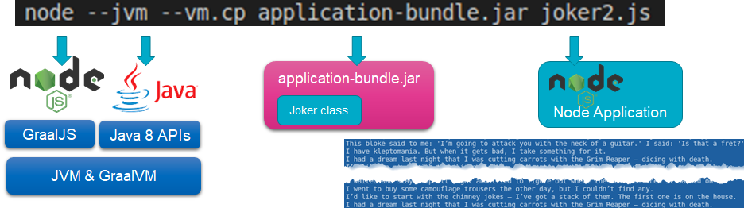
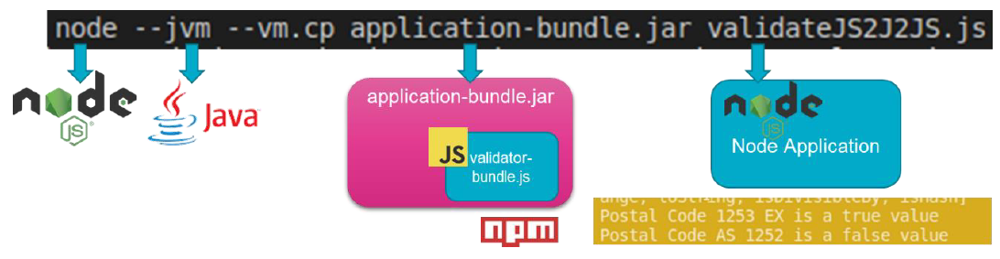

# Polyglot Node applications calling Java
Just like Java applications running on GraalVM can execute JavaScript, so can JavaScript or Node applications instantiate Java Classes and invoke Java objects.


## The Joker Node Applications Getting his Jokes from is Java Sidekick

check out file Joker.js. It is monoglot – and utterly dull. The Joker does not have a single Joke. Very unfortunate.

```
cd /labs/js2java
cat joker.js
```{{execute}}

Run the Node application - and get the expected dull results:
`node joker.js`{{execute}} 

You will not be dazzled, no tricks up anyone’s sleeves.

Now look at the contents of the file joker2.js. 

```
cat /labs/js2java/joker2.js
```{{execute}}

Things start to look more interesting. The joker still does not have any jokes – but he has a friend. A Java Class, called Joker, that may help out. Look at this Java Class:
```
cat /labs/js2java/nl/amis/js2java/Joker.java
```{{execute}}

See how this class is coded. And notice that class is not aware of the fact that it is used in a polyglot context. This is just a regular Java Class, doing its thing.

Now look how the Java Class is defined in the Node application with the `Java.type` instruction and how from that type a Joker object is instantiated `new javaJokerClass()`. This produces an object on which the JavaScript code can invoke methods just like functions on regular JS objects: `javaJoker1.getJoke()`. 

Run the application with this command

`node --jvm --vm.cp application-bundle.jar joker2.js`{{execute}}

Note: the file application-bundle.jar contains the Joker.class file. The `--vm.cp` switch provides the GraalVM runtime with a classpath reference to the Java Classes that the Node application intends to invoke. 

Now there should be jokes cracked left and right. They must be produced by the Java Joker. 


## Pass Parameters Back and Forth 

File joker3.js takes another step. It shows how we can post parameters and exchange more complex objects – such as an Array and a Map – between JavaScript and Java..
```
cat /labs/js2java/joker3.js
```{{execute}}

Run the application with this command

`node --jvm --vm.cp application-bundle.jar joker3.js`{{execute}}

## VALIDATOR APPLICATION - Node calling Java calling JavaScript
Open file validateJS2J2JS.js. The JavaScript application wants to validate a Postal Code. The developer knew about the Java Class ValidateThroughNPMValidator that we created a little earlier on, so she though she might as well make use of it.

Run the application with this command
`node --jvm --vm.cp application-bundle.jar validateJS2J2JS.js`{{execute}}
and find that two postal codes are validated.

The remarkable thing here is that what is actually taking place is JavaScript executing Java code that in turn is executing JavaScript code. Not an obvious thing to do – but not a problem on a technical level.

