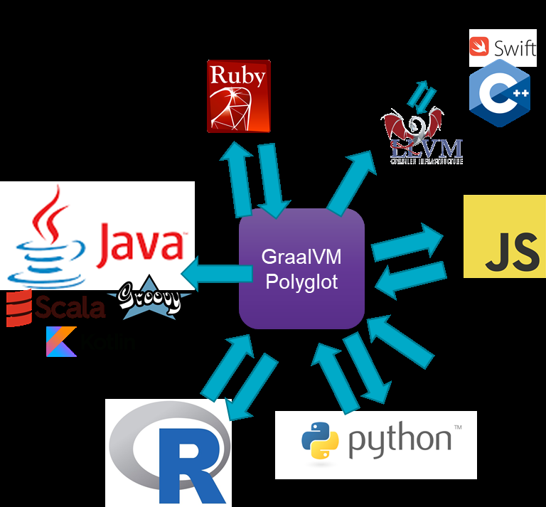

# Bonus: Multi-directional Polyglot

In this section, we will look at some examples of polyglot language interaction, not necessarily focused on Java, and involving more than just two languages.


## FROM PYTHON TO JAVASCRIPT, JAVA AND R

This article describes in detail a Python application running on GraalVM and interacting with both JavaScript, R and Java. The code discussed in the article is also available in the VM.
To try it out, run the application with this command – on the command line from directory /home/developer/graalvm-polyglot-meetup-november2019/polyglot:

```
cd /labs/polyglot

graalpython --polyglot --jvm ./python_polyglot.py
```{{execute}}

##FROM JAVASCRIPT TO PYTHON AND R

Similar - but taking JavaScript as the starting language – is polyglot.js. This JavaScript application loads a Python library and invokes the Python function object that is created by that library. It also uses an R snippet that creates a function object and hands it back to the Polyglot context for all participating language contexts to invoke.

To try it out, run the application with this command – on the command line from directory /labs/polyglot:

`js --polyglot --jvm polyglot.js`{{execute}}

Please, take this opportunity and modify the source polyglot.js. Make it jump through more hoops. Make the polyglot contexts share even more.